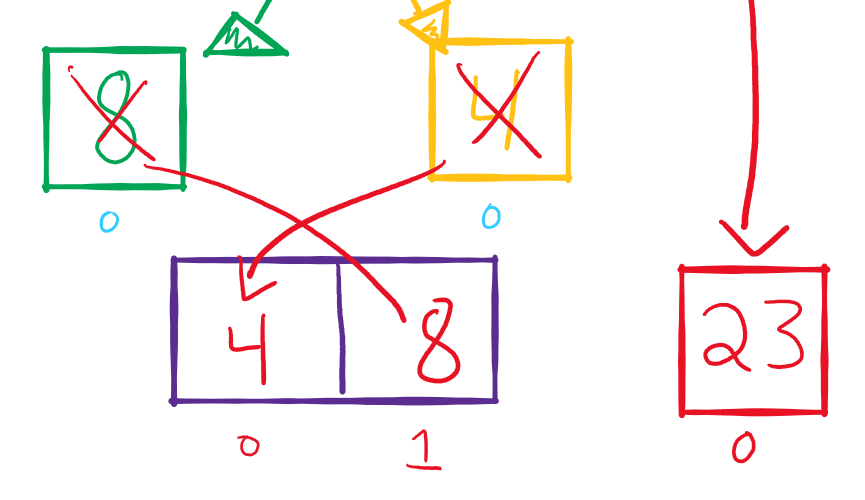

# Merge Sorting!
### Author: Daisy Johnson

***Hello!!!***, today we are going to be talking about merge sorting! Merge sorting is the sort method where you break down a single list into smaller lists until each list consists of only one element. You then merge those smaller lists together in sorted order until you are left with a complete sorted list!

Lets take a look at some good 'ol pseudocode!
```
Algorithm mergeSort(arr)
DECLARE n <-- arr.length

if n > 1
DECLARE mid <-- n/2
DECLARE left <--arr[0...mid]
DECLARE right <-- arr[mid...n]

mergeSort(left)
mergeSort(right)
mergeSort(left, right, arr)

ALGORITHM Merge(left, right, arr)
DECLARE i <-- 0
DECLARE j <-- 0
DECLARE k <-- 0

while i < left.length && j < right.length
        if left[i] <= right[j]
            arr[k] <-- left[i]
            i <-- i + 1
        else
            arr[k] <-- right[j]
            j <-- j + 1
            
        k <-- k + 1

    if i = left.length
       set remaining entries in arr to remaining values in right
    else
       set remaining entries in arr to remaining values in left
```

Easy enough right?! Well just to make sure lets go through it step-by-step.

* First we will start with a lovely unsorted array, we are going to then split the array in half(or as evenly as possible).


* Then we will take a look at the smaller list on the left side, we are going to want to do the same thing as before and split the list in half as evenly as possible. 


* Let's keep on moving and look at the next smallest lift down to the left. There are two elements in this list so we gotta split them up again!


* Now we are left with two smaller lists with a single element in each. When there is only a single element left in a list that means it is ready to be merged!
* Now that we have all our single elements ready to go, we are gonna merge them back together, but this time in sorted order. When you compare 8 and 4, 4 is the smaller integer so it's going to move to the first spot in the list. Then we can put 8 into the remaining spot.



* We are back up the line and now see our ol' friend 24! Since 24 is a single element within its list that means it's ready to be merged. Let's merge them all together! 4 is still the smallest, 8 is smaller than 24, and 24 is the largest so we will put them in their rightful spots!


* We have the first half all done! Woo hoo!, let's move on to the right side, and start by splitting it as evenly as possible.


* It looks like the right side is a single element and can't be split anymore so let's keep moving on the left and split is evenly again!


* Ahhhh once again we have two lists with single elements. They are ready to merge so let's put them back together in sorted order. 16 is less than 42 so it will slide into the first spot and 42 will jump to the end!


* Okey doke, we are ready to merge our sorted pair and single lement on the right. 15 is smaller than 16 so it will take its rightful place at the front. 16 is smaller than 42 so it will jump to the middle and 42 will go to the back of the line!


* We have both halves sorted, and ready to merge! We can sort through all of the elements and put them smallest to greatest, leaving us with a beautiful sorted array!


Merge sorting is just a matter of dividing and conquering, and if you followed along you will be a master in no time!