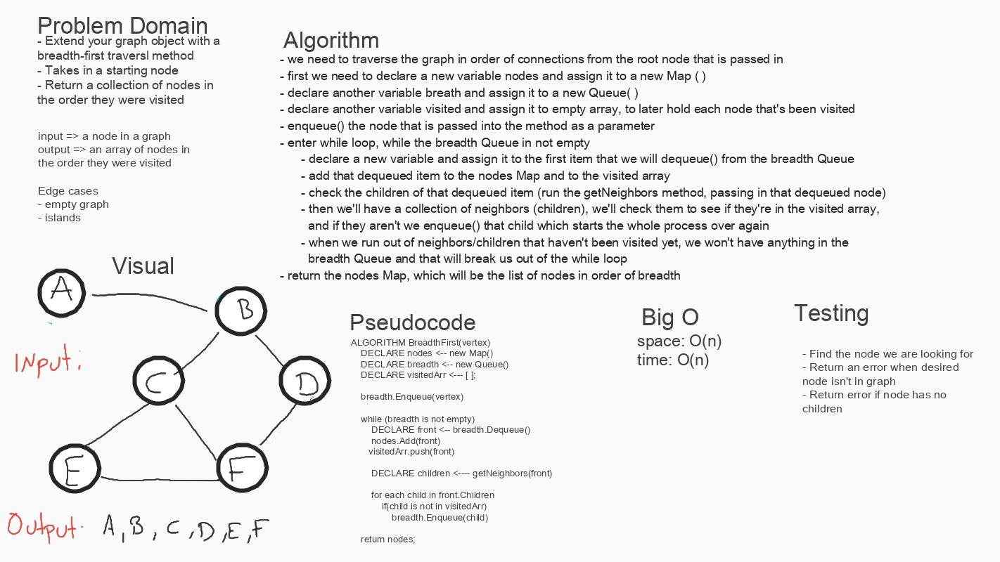

# Graph- Breadth First
Implement a breadth-first traversal on a graph.

## Challenge
Extend your graph object with a breadth-first traversal method that accepts a starting node. Without utilizing any of the built-in methods available to your language, return a collection of nodes in the order they were visited. Display the collection.

## Approach & Efficiency
* Big O of space and time are going to be O(n) because the efficiency depends on the amount of nodes we are searching through and storing into our visited array.

## API
* breadthFirst: Searches through a graph and returns a collection of nodes in the order they were visited

