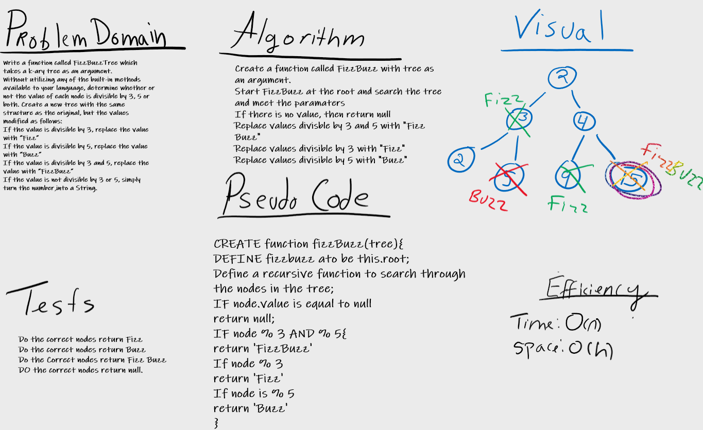

# FIZZ BUZZ TREE
Conduct “FizzBuzz” on a k-ary tree while traversing through it to create a new tree
Set the values of each of the new nodes depending on the corresponding node value in the source tree.

## Challenge
* Write a function called FizzBuzzTree which takes a k-ary tree as an argument.
* Without utilizing any of the built-in methods available to your language, determine whether or not the value of each node is divisible by 3, 5 or both. 
* Create a new tree with the same structure as the original, but the values modified as follows:
* If the value is divisible by 3, replace the value with “Fizz”
* If the value is divisible by 5, replace the value with “Buzz”
* If the value is divisible by 3 and 5, replace the value with “FizzBuzz”
* If the value is not divisible by 3 or 5, simply turn the number into a String.
Return a new tree.

## Approach & Efficiency
Big O of  time is O(h) or (height) because in the worst case, er have to search all the way down to a leaf, which will require searching through as many nodes as the tree is tall/
Big O of space is O(1) because during a search we are not allocating any additional space.

## API
<!-- Description of each method publicly available in each of your trees -->
* find-maximum-value: returns the maximum value within the tree

## Whiteboard

