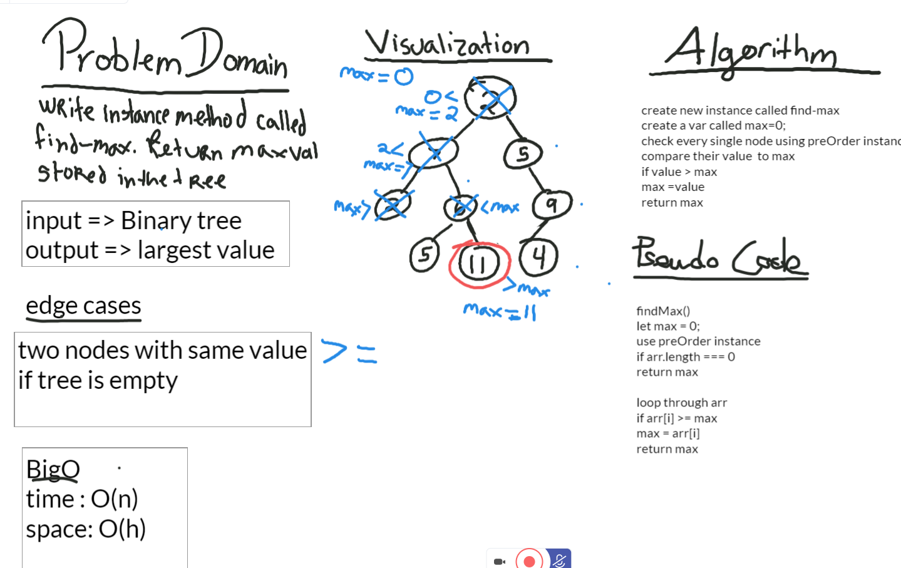
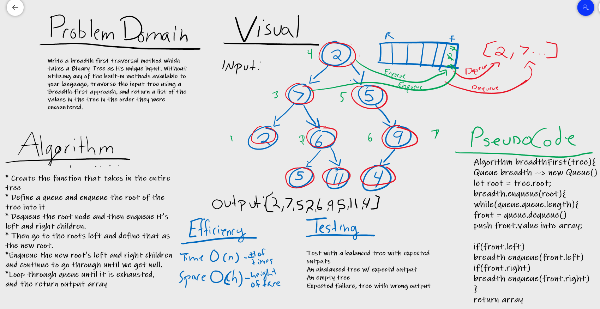

# Trees
Building a binary tree data structure.

## Challenge
* Create a Node class that has properties for the value stored in the node, the left child node, and the right child node.
* Create a BinaryTree class
* Define a method for each of the depth first traversals called preOrder, inOrder, and postOrder which returns an array of the values, ordered appropriately.
* Any exceptions or errors that come from your code should be semantic, capturable errors. For example, rather than a default error thrown by your language, your code should raise/throw a custom, semantic error that describes what went wrong in calling the methods you wrote for this lab.

* Create a BinarySearchTree class
* Define a method named add that accepts a value, and adds a new node with that value in the correct location in the binary search tree.
* Define a method named contains that accepts a value, and returns a boolean indicating whether or not the value is in the tree at least once.

## Approach & Efficiency
Big O of  time is O(h) or (height) because in the worst case, er have to search all the way down to a leaf, which will require searching through as many nodes as the tree is tall/
Big O of space is O(1) because during a search we are not allocating any additional space.

## API
<!-- Description of each method publicly available in each of your trees -->
* preOrder: returns an array of the values ordered root, left, right.
* inOrder: returns an array of the values ordered left, root right.
* postOrder returns an array of the values ordered left, right, root.
* Add: accepts a value, and adds a new node with that value in the correct location in the binary search tree.
* Contains: accepts a value, and returns a boolean indicating whether or not the value is in the tree at least once.

# Find Maximum Value
Find the Maximum Value in a Binary Tree

## Challenge
* Write an instance method called find-maximum-value. Without utilizing any of the built-in methods available to your language, return the maximum value stored in the tree. You can assume that the values stored in the Binary Tree will be numeric.

## Approach & Efficiency
Big O of  time is O(h) or (height) because in the worst case, er have to search all the way down to a leaf, which will require searching through as many nodes as the tree is tall/
Big O of space is O(1) because during a search we are not allocating any additional space.

## API
<!-- Description of each method publicly available in each of your trees -->
* find-maximum-value: returns the maximum value within the tree

## Whiteboard

# Chall 18 Breadth First
Breadth-first Traversal.

## Challenge
*Write a breadth first traversal method which takes a Binary Tree as its unique input. Without utilizing any of the built-in methods available to your language, traverse the input tree using a Breadth-first approach, and return a list of the values in the tree in the order they were encountered.

## Approach & Efficiency
Big O of  time is O(h) or (height) because in the worst case, we would have to search all the way down to a leaf, which will require searching through as many nodes as the tree is tall/
Big O of space is O(1) because during a search we are not allocating any additional space.

## API
<!-- Description of each method publicly available in each of your trees -->
* find-maximum-value: returns the maximum value within the tree

## Whiteboard

